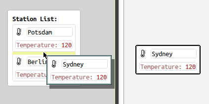

# Lists of Blocks

A common pattern is to have an extensible list of blocks.
For this, we need to do three things:
1. inform the system that our block can take multiple children
2. inform the system which blocks our block can take as multiple children
3. add a method that creates new instances of our desired type of children



#### 1. Mark as List Block
The first step is simple. Assume we have a `MyListBlock` block subclass. All we need to do is:
```
MyListBlock>>fixedNumberOfChildren

    ^ false
```

#### 2. Communicate Block Interfaces
For the second step, we communicate the object interface that the block needs to fulfill:
```
MyListBlock>>objectInterfaceNear: aBlock at: aSymbol

    ^ {[:o | o isKindOf: MyChildWidget]}
    " or "
    ^ {#isMyChildWidget}
    " or "
    ^ {#isMyChildWidget understood. #isMyChildWidget}
```
The symbols or blocks you provide in this list will be checked one by one on the incoming block and only if all return true, the block is allowed to be added.

#### 3. Provide a Creator Method
Lastly, we will want to inform the system what the default block should look like if the user presses the insert-child shortcut.
```
MyListBlock>>newEmptyChildNear: aBlock before: aBoolean

    ^ MyChildWidget new contents: 'empty'
```


